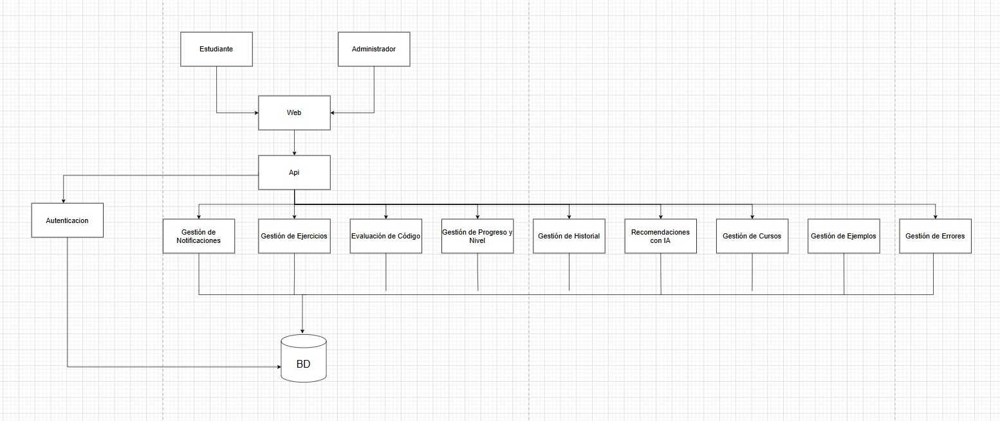
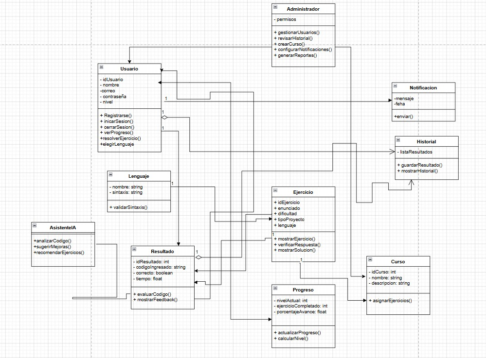

# Kick-code

## Nombre del proyecto: **Kick-code**

### Integrantes:
- Juan Diego Zapata
- Luis Rodrigo Ulloa
- Kevin adrian Osorio

**Descripcion del sistema:**
Kick-code es una plataforma de aprendizaje de programación diseñada para ayudar a los estudiantes o programadores juniors a mejorar sus habilidades de codificación a través de ejercicios prácticos y teóricos. La plataforma ofrece una variedad de ejercicios de programación en diferentes lenguajes, con niveles de dificultad adaptados al progreso del usuario. Además, Kick-code proporciona retroalimentación inmediata sobre los ejercicios realizados, detectando errores de sintaxis y ofreciendo explicaciones teóricas cuando sea necesario. El objetivo de Kick-code es fomentar el aprendizaje activo y mejorar la velocidad de programación de los estudiantes, brindándoles una experiencia de aprendizaje interactiva y personalizada.

**Contenido de la carpeta docs:**
- **[Requerimientos.md:](docs/Requeremientos.md)** Contiene los requerimientos funcionales del sistema.

- **[CasosUsos.md:](docs/CasosUsos.md)** Contiene los casos de uso del sistema.

- **[architectura.jpeg:](docs/Arquitectura.jpeg)** Contiene la arquitectura del sistema.

- **[diagrama.png:](docs/diagrama.png)** Contiene el diagrama de clases del sistema.

- **[Grupo3_SRS_Archivofinal.pdf:](docs/Grupo3_SRS_Archivofinal.pdf)** Contiene nuestro Archivo final con toda la informacion del proyecto Kick-code.l.